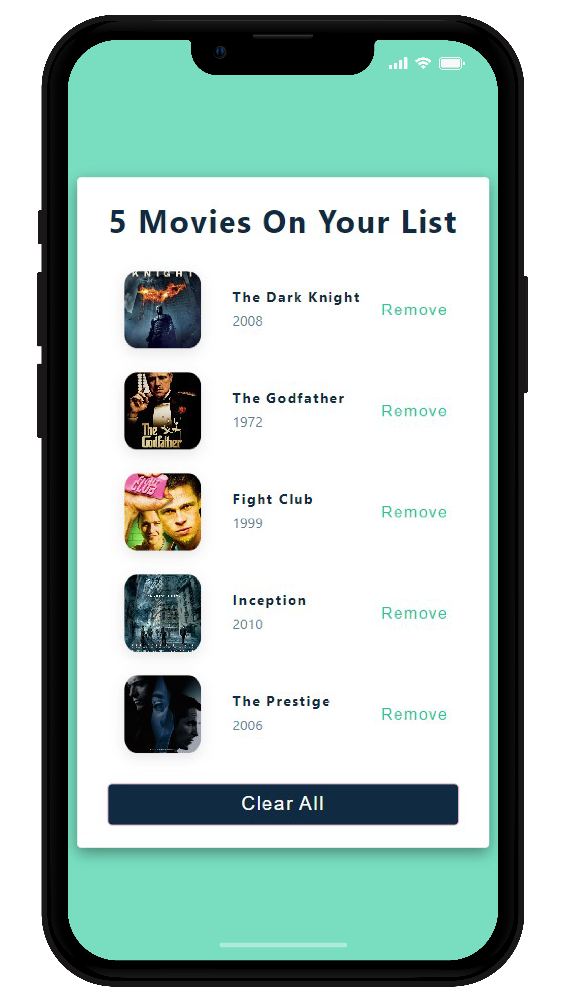
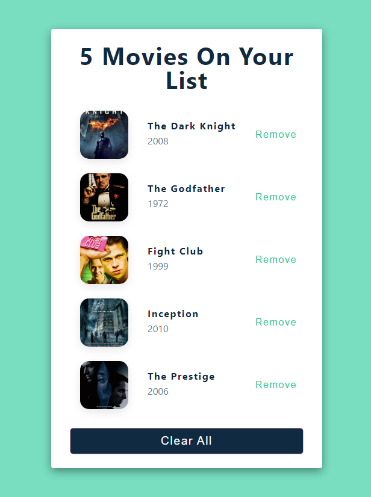

## Movie List project

[Check it out](https://movie-list2022.netlify.app/)

 

Simple React application that renders a list of movies with their name, year, and image.

The code demonstrates the simplicity and flexibility of React by using functional components and props to render a dynamic list of movies. It also showcases the benefits of functional programming in React, which allows for cleaner and more readable code. Overall, the code presents a good example of how React can be used to create simple and effective applications.
